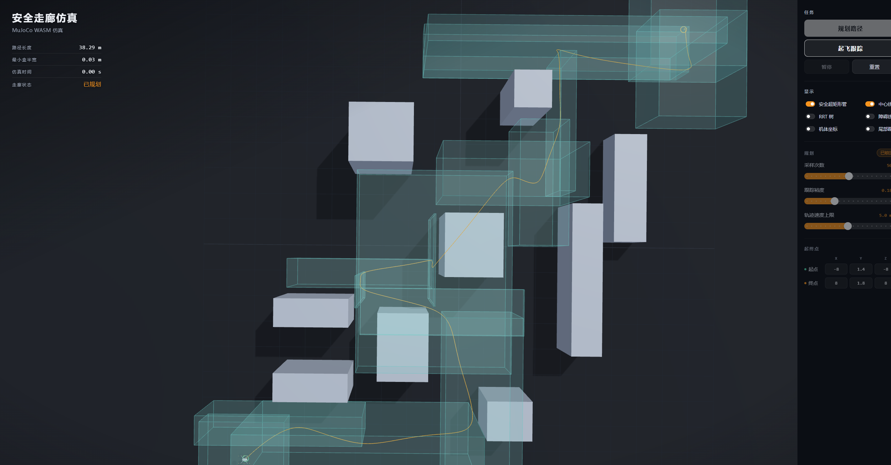
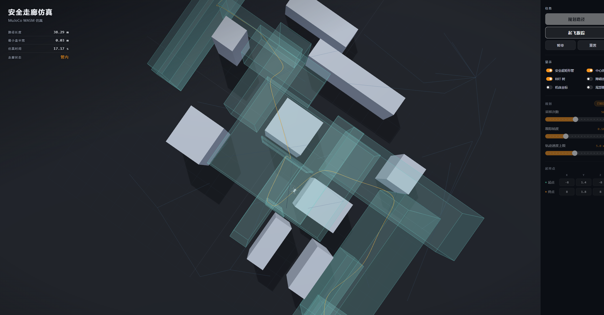
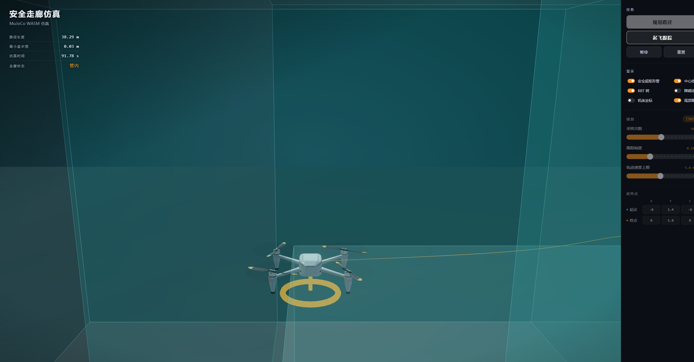

# 基于 Three.js 与 MuJoCo WASM 的无人机安全走廊仿真

浏览器里可交互的四旋翼到达–避障仿真：用 [Three.js](https://threejs.org/) 做三维场景，用 Google DeepMind 官方 [MuJoCo WASM](https://github.com/google-deepmind/mujoco/tree/main/wasm) 做刚体动力学，规划层实现 IEEE TAC 论文 *Reach-Avoid Control Synthesis for a Quadrotor UAV With Formal Safety Guarantees* 中的安全超矩形管 + Bézier–LP 轨迹 + 几何跟踪控制。

**仓库：** [https://github.com/ZHT1235456/MujocoWASM](https://github.com/ZHT1235456/MujocoWASM)

作者：朱华天，Grok 4.6，GPT 5.6 Sol。桌面封装：Composer 2.5 × Tauri 2。

## 界面预览

规划完成后的安全走廊与中心线：



几何控制跟踪过程（机体沿管飞行）：



尾部跟拍，到达终点后定点悬停：



待机俯视、RRT 树与跟拍特写另见 [`docs/figures/`](docs/figures/)。中文说明文档（LaTeX）在 [`docs/main.tex`](docs/main.tex)。

## 它做什么

1. 在杂乱盒形障碍中，用计入跟踪裕度的 RRT 构造**安全超矩形管**。
2. 在管内用分段 Bézier 曲线与 GLPK 线性规划生成名义轨迹。
3. 用 $\mathrm{SE}(3)$ 几何控制把 MuJoCo 里的四旋翼刚体拉向该轨迹。
4. Three.js 同步位姿、半透明走廊、中心线与可选 RRT 树；机体外观来自 `reference/drone` 的三视图标定模型。

左键旋转，滚轮缩放，右键平移。先选择 **规划路径(对称安全盒)** 或 **规划路径(非对称安全盒)**，成功后再 **起飞跟踪**。非对称模式使用含当前航点的最大体积安全盒，以减少对称扩张造成的可行空间浪费。

## 快速开始

需要 Node.js 18+。MuJoCo WASM 依赖跨源隔离，开发服务器已在 `vite.config.js` 里设置 COOP / COEP。

```bash
npm install
npm run dev
```

浏览器打开终端提示的本地地址（默认 `http://localhost:5173/`）。

```bash
npm test          # 规划、控制、MuJoCo 与飞行回归
npm run build     # 网页生产构建
npm run tauri:dev # Tauri 2 桌面调试（需 Rust）
npm run tauri:build
```

编译说明文档（需 TeX Live / MiKTeX，XeLaTeX）：

```bash
cd docs
xelatex main.tex
bibtex main
xelatex main.tex
xelatex main.tex
```

## 技术栈

| 层 | 选择 | 说明 |
| --- | --- | --- |
| 渲染 | Three.js r170 | 场景图、软阴影、OrbitControls |
| 物理 | `@mujoco/mujoco` 3.11 | 官方 WASM，MJCF + `mj_step` |
| 规划 | 自研 JS | 超矩形安全集、RRT 管、Bézier |
| 优化 | `glpk.js` | 管内轨迹 LP |
| 控制 | 几何跟踪 + 混控 | 推力–力矩 → 四电机 |
| 构建 | Vite 6 | ESM、WASM 资源、COOP/COEP |
| 桌面 | Tauri 2 | WebView2 + NSIS |

MuJoCo 原生是 C/C++，Python 绑定也适合论文复现和批处理。本仓库走官方 WASM，是为了同一份前端既能在浏览器里打开，也能经 Tauri 打成桌面程序：核心引擎仍是那份 C/C++ 实现，经 Emscripten 编译后由 JavaScript 调用，运行环境收束为一个现代浏览器或系统 WebView。

Vite 生产构建后的 `dist/` 约 10.6 MB，其中 `mujoco.wasm` 约 9.65 MB，Three.js 与业务脚本合计约 0.9 MB。本机 `drone-corridor.exe` 约 4.7 MB，NSIS 安装包经 LZMA 压缩后约 3.3 MB。安装包几乎全部重量来自 WASM 物理引擎；Windows 上的 WebView2 由系统提供，不随包携带 Chromium。

## 目录

```
├── index.html              单页入口
├── src/
│   ├── main.js             主循环：规划 / 起飞 / 跟拍
│   ├── world.js            运行时生成 MJCF
│   ├── world-scene.js      工作域、障碍、电机站点
│   ├── coords.js           MuJoCo Z-up ↔ Three.js Y-up
│   ├── sim/mujoco.js       WASM 加载与步进
│   ├── plan/               超矩形、RRT 管、Bézier–LP
│   ├── control/            几何控制与混控
│   ├── vis/                场景、机体同步、走廊网格
│   └── ui/panel.js         侧栏与 HUD
├── reference/drone/        按三视图标定的四旋翼外观
├── paper/                  TAC 论文文本
├── scripts/                无浏览器回归测试
├── src-tauri/              Tauri 2 工程
└── docs/                   LaTeX 文档与截图
```

## 模型分工

- **Grok 4.6**：前端与规划–跟踪流水线。
- **GPT 5.6 Sol**：缺陷修复（混控、LP 可行性、桨叶可见性、违约消抖等）。
- **Composer 2.5**：Tauri 2 打包。

## 参考文献

1. M. Serry, Y. Yuan, H. Chang, and J. Liu, “Reach-Avoid Control Synthesis for a Quadrotor UAV With Formal Safety Guarantees,” *IEEE Transactions on Automatic Control*, vol. 71, no. 8, pp. 4939–4955, Aug. 2026. [doi:10.1109/TAC.2026.3664766](https://doi.org/10.1109/TAC.2026.3664766)
2. [Three.js 手册](https://threejs.org/manual/en/fundamentals.html)
3. [MuJoCo Overview](https://mujoco.readthedocs.io/en/stable/overview.html) · [WASM 绑定](https://github.com/google-deepmind/mujoco/tree/main/wasm)
4. [Tauri 2](https://v2.tauri.app/start/)

更完整的中文叙述、目录表与操作截图见 [`docs/main.tex`](docs/main.tex)。
